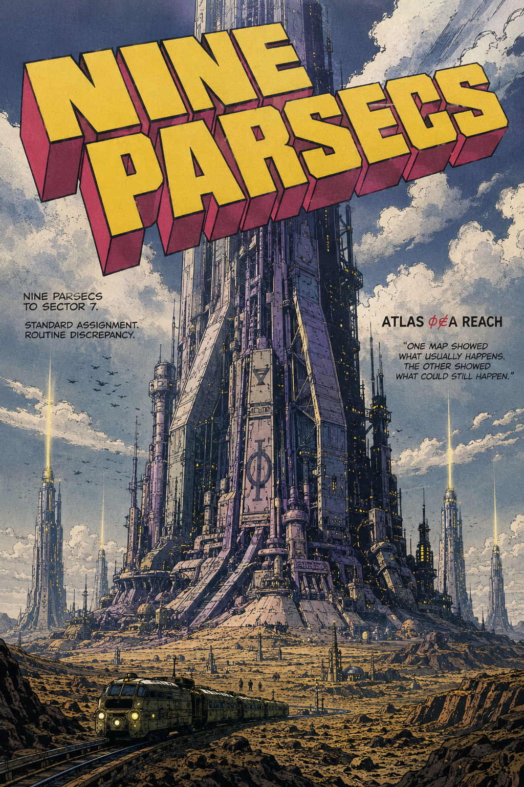
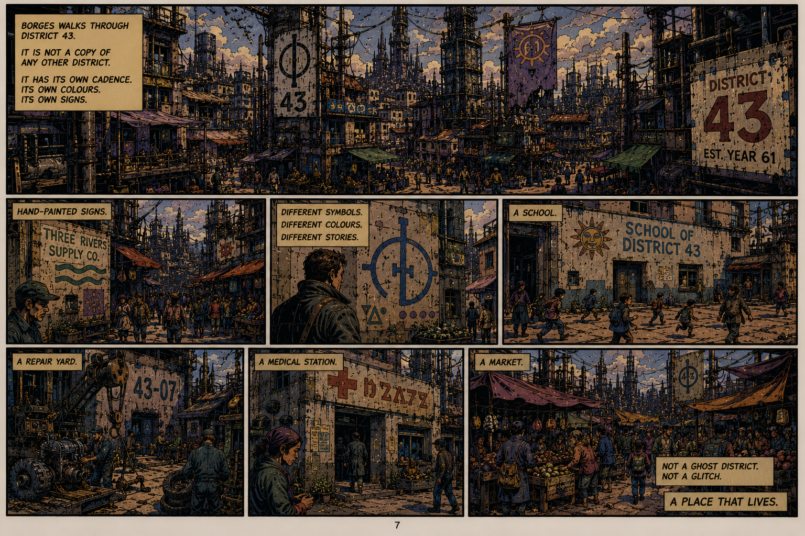

# Memnet Derivatives

[The Geometry of Admissibility](https://standardgalactic.github.io/memnet/derivatives/geometry-of-admissibility.pdf)

[Spherepop Algebra](https://standardgalactic.github.io/memnet/derivatives/spherepop-algebra.pdf)

[Against Latent Fundamentalism](https://standardgalactic.github.io/memnet/derivatives/against-latent-fundamentalism.pdf)

* [Academic](https://standardgalactic.github.io/memnet/derivatives/against-latent-fundamentalism-academic.pdf)

* [What Any Mind Must Preserve](https://standardgalactic.github.io/memnet/derivatives/against-latent-fundamentalism-cogsci.pdf) — *Cognitive Science*

* [The Suture That Will Not Hold](https://standardgalactic.github.io/memnet/derivatives/suture-theory.pdf) — *Critical Theory*

* [Admissibility Distortion](https://standardgalactic.github.io/memnet/derivatives/admissibility-distortion.pdf) — *Mechatronics*

* [Nine Parsecs](https://standardgalactic.github.io/memnet/derivatives/nine_parsecs.pdf) — *Screenplay*

[Reachable History](https://standardgalactic.github.io/memnet/derivatives/) — *Audio Overviews*

