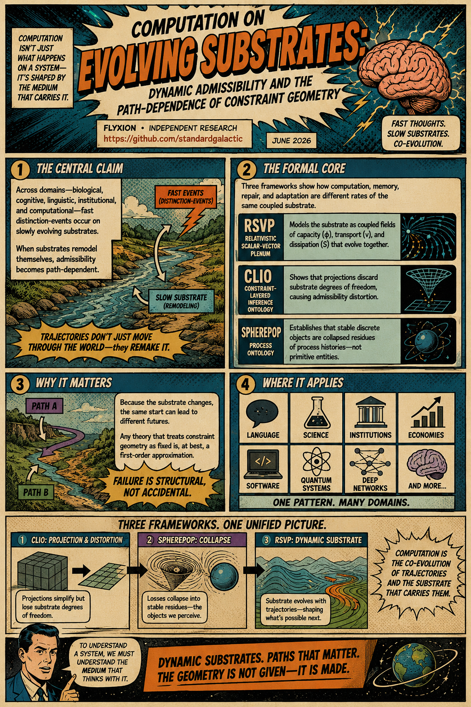
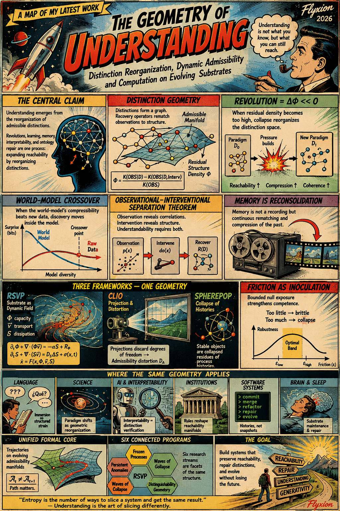

# Memnet | Perspectives

[Variable Drift](https://standardgalactic.github.io/memnet/perspectives/variable-drift.pdf)

[City of Brutes](https://standardgalactic.github.io/memnet/perspectives/city_of_brutes.pdf)

[Distinction Reorganization](https://standardgalactic.github.io/memnet/perspectives/distinction_reorganization.pdf)

[Intelligence as Distinction Repair](https://standardgalactic.github.io/memnet/perspectives/intelligence-as-distinction-repair.pdf)

[Reconstruction and Distinction](https://standardgalactic.github.io/memnet/perspectives/reconstruction_and_distinction.pdf)

[Dynamic Substrate](https://standardgalactic.github.io/memnet/perspectives/dynamic_substrate.pdf)

[Meta-Ontological Reproduction](https://standardgalactic.github.io/memnet/perspectives/meta_ontological_reproduction.pdf)

[The Ecology of Distinctions](https://standardgalactic.github.io/memnet/perspectives/The_Ecology_of_Distinctions.pdf)

[Audio Overviews](https://standardgalactic.github.io/memnet/perspectives/)

